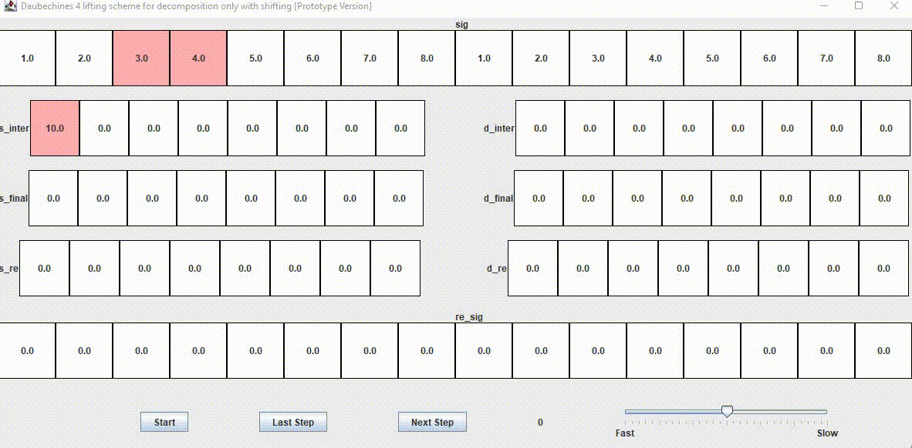

# Introduction

This project was originally designed to complete an assignment for the course, Advanced programming. It is useful both as an assignment and as a pedagogical tool for the course, Efficient video coding. It is inspired by the project [mossblaser/streaming_wavelet_toy](https://github.com/mossblaser/streaming_wavelet_toy). Mossblaser's wavelet toy uses simplified  [BBC VC-2 wavelet](https://bbc.github.io/vc2_conformance/user_guide/generating_static_analyses.html) core and print the output to console which is hard to read.

This project implements the lifting scheme for Daubechies 4 wavelet using Java Swing, which allows user to adjust the speed and pause the animation.

Using the vertical box layout, the main layout of the panel contains two parts:

1. `vBox_up` part is used for displaying the animation
2. `vBox_down` part is used for control

Animation is realized by a timer.

All data is calculated and packed by the class `Wavelet` before drawing in GUI.

For further update, visit my github page [holdenzlL/Wavelet_String_Toy_JAVA_Swing (github.com)](https://github.com/holdenzlL/Wavelet_String_Toy_JAVA_Swing).

## GIF demo

